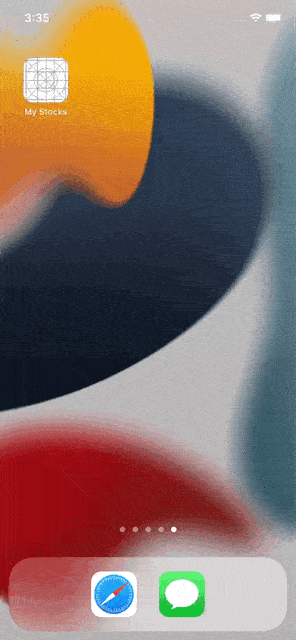
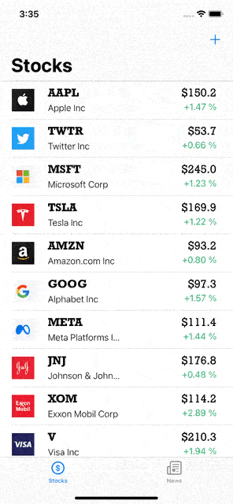
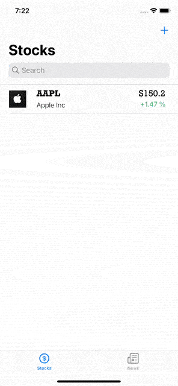

<h1 align="center">My Stocks</h1> 

## Описание тестового задания
Необходимо создать мобильное приложение для мониторинга цен акций на
бирже со следующей минимальной функциональностью:
* На стартовом экране отображается список акций. У каждой акции
указан тикер, название компании, текущая цена и изменение цены за
сутки.
* Пользователь может добавлять акции в избранные и отдельно
просматривать этот список.
* Пользователь может искать акции по тикеру или названию и
добавлять их в избранные.

## Технические характеристики приложения

* iOS 13+
* Swift 5
* UIKit(programmatically UI and Storyboard)
* MVC
* Пакеты: SVGKit and Charts
* API: https://finnhub.io

## Обзор экранов приложения

<table>
    <thead>
        <tr>
            <th>Основной экран</th>
            <th>Лента новостей</th>
            <th>Удаление/поиск/добавление</th>
        </tr>
    </thead>
    <tbody>
        <tr>
            <td>
                
            </td>
            <td>
                
            </td>
                        <td>
                
            </td>
        </tr>
    </tbody>
</table>

<table>
    <thead>
        </tr>
    </tbody>
</table>

## Описание элементов приложения

1. Основной экран:
    * Обновление котировок по свайпу вниз
    * Переходы на экраны поиска акции и подробной информации об акции
    * Возможность поиска акции по названию тикера
    * Возможность удалить акцию из таблицы свайпом влево
2. Лента новостей
    * Новости отсортированы по времени появления
    * Возможность поиска новости по тикеру акции
    * Обновление ленты новостей по свайпу вниз
3. Экран поиска акций
    * Возможность добавить акцию на основной экран
    * Возможность предварительного просмотра информации по акции на отдельном экране
    * Ранее добавленные акции нельзя добавить повторно
    
